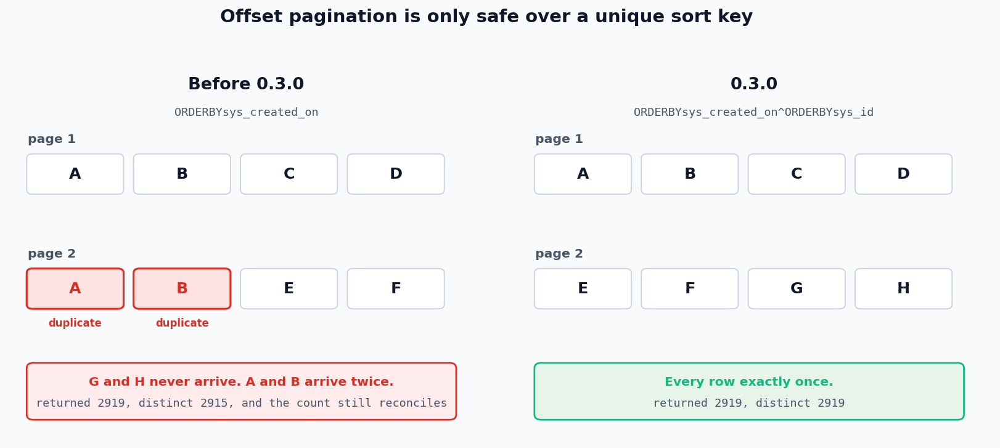

Trusting a Sweep
================

A paginated read can come up short without anything failing. No error status,
no exception, and a returned row count that still matches what the instance
reports. This page explains how that happens, what 0.3.0 does about it, and
how to prove a sweep was complete rather than hoping it was.

.. contents::
   :local:
   :depth: 1

The failure this page exists for
--------------------------------

ServiceNow offset pagination is only safe over a **unique** sort key. The API
does not guarantee a stable order inside a group of rows that tie on the sort
column, so a page boundary landing inside a tied group can return some rows
twice and skip others.

Every release before 0.3.0 sorted on ``sys_created_on``, which is not unique.

         returns some rows twice and skips others
   :align: center
   :width: 100%

On a developer instance, ``cmdb_ci`` holds 2,919 rows spread across only 818
distinct ``sys_created_on`` values, and 31 rows share the single worst
timestamp. Three consecutive sweeps of that table:

.. code-block:: text

   run 1: returned=2919 distinct=2915 lost=4 duplicated=4 count_matches_api=True
   run 2: returned=2919 distinct=2915 lost=4 duplicated=4 count_matches_api=True
   run 3: returned=2919 distinct=2915 lost=4 duplicated=4 count_matches_api=True

Two things about that are worse than they first look.

**The count reconciles.** The instance reports 2,919 and the sweep returns
exactly 2,919. Four records were replaced by four duplicates, so nothing
anywhere reports a problem.

**The loss is deterministic.** The same four records go missing every run.
Re-running never surfaces it, and diffing two runs shows nothing, because
they agree with each other and are both wrong.

At that rate a 30,000 row CMDB loses roughly 40 CIs. For a CMDB feeding a
dependency graph, missing CIs mean missing dependencies mean a wrong blast
radius, with nothing downstream able to detect it.

What 0.3.0 changed
------------------

Every paginated request now ends its ORDERBY chain with ``sys_id``, the one
column ServiceNow guarantees unique:

.. code-block:: text

   before   sysparm_query=ORDERBYsys_created_on
   after    sysparm_query=ORDERBYsys_created_on^ORDERBYsys_id

The chronological intent survives. The tiebreak makes the order total, so a
page boundary inside a tied group is deterministic. This was confirmed as a
genuine two column sort against a live instance: across 2,101 adjacent pairs
sharing a timestamp, ``sys_id`` ascended inside every one of them.

Same table, same instance, same session:

.. list-table::
   :header-rows: 1
   :widths: 45 15 15 25

   * - Path
     - Lost
     - Duplicated
     - Verdict
   * - ``get_records`` before 0.3.0
     - 4
     - 4
     - lossy
   * - ``get_records`` 0.3.0
     - 0
     - 0
     - clean
   * - ``concurrent_get_records`` before 0.3.0
     - 4
     - 4
     - lossy
   * - ``concurrent_get_records`` 0.3.0
     - 0
     - 0
     - clean

Nothing in your code has to change to get this. It applies to both the sync
and the async connection, to the threaded paginator, and to every loader.

Choosing your own sort
----------------------

``order_by`` controls the chain. ``sys_id`` is appended as a tiebreak unless
the chain already sorts on it:

.. code-block:: python

   from snowloader import SnowConnection

   # The default. Chronological, with a unique tiebreak.
   conn = SnowConnection(..., order_by="sys_created_on")
   # sends ORDERBYsys_created_on^ORDERBYsys_id

   # Fastest on most instances, since sys_id is the clustered key.
   conn = SnowConnection(..., order_by="sys_id")
   # sends ORDERBYsys_id

   # Several columns.
   conn = SnowConnection(..., order_by=["category", "priority"])
   # sends ORDERBYcategory^ORDERBYpriority^ORDERBYsys_id

   # Descending, written as a ServiceNow clause.
   conn = SnowConnection(..., order_by="ORDERBYDESCsys_created_on")
   # sends ORDERBYDESCsys_created_on^ORDERBYsys_id

   # No ordering at all. You are on your own for completeness.
   conn = SnowConnection(..., order_by=None)

An empty string or an empty list is refused rather than treated as an
opt-out, because paginating with no sort key silently loses records and that
is not something to do by accident. Use ``None`` when you mean it.

Proving a sweep was complete
----------------------------

Correct ordering is necessary and not sufficient. A page can fail, a query
can race an insert, an instance can behave in a way nobody predicted. Pass
``verify=True`` and the sweep counts the table before reading it, then
checks that it returned that many distinct records:

.. code-block:: python

   from snowloader import SnowConnection, SweepIncompleteError

   conn = SnowConnection(...)

   try:
       records = list(conn.get_records("cmdb_ci", verify=True))
   except SweepIncompleteError as exc:
       print(exc.report)
       # table=cmdb_ci expected=2919 returned=2919 distinct=2915
       # missing=4 duplicated=4 failed_pages=0
       raise

Once the ordering is right this check finds nothing, and that is the point.
You can trust a sweep instead of hoping about it, and nobody has to
independently rediscover the ordering bug in order to be safe from it.

It works the same on every path:

.. code-block:: python

   conn.get_records("cmdb_ci", verify=True)
   conn.concurrent_get_records("cmdb_ci", verify=True, max_workers=16)

   IncidentLoader(conn).load(verify=True)
   IncidentLoader(conn).concurrent_load(verify=True)

   async for rec in aconn.aget_records("cmdb_ci", verify=True):
       ...

What it costs
~~~~~~~~~~~~~

On :meth:`SnowConnection.get_records`, one extra request to
``/api/now/stats``. On the threaded and async paths, nothing at all: they
already fetch that count to plan their pages.

Memory is the real cost. Verification holds one 32 character key per record,
which measures at about 100 bytes each once Python's string and set overhead
is counted, so roughly 50 MB on a half million row table. That is why it is
opt-in rather than always on.

The check runs at the end, so consume the whole sweep
~~~~~~~~~~~~~~~~~~~~~~~~~~~~~~~~~~~~~~~~~~~~~~~~~~~~~

These methods are generators and the comparison happens after the last
record is yielded. A caller that stops early never reaches it:

.. code-block:: python

   # Verified. The list drains the generator.
   records = list(conn.get_records("cmdb_ci", verify=True))

   # Not verified, and nothing says so. The generator is abandoned
   # after one record, so the check never runs.
   first = next(conn.get_records("cmdb_ci", verify=True))

That is the right behaviour, since half a sweep cannot be complete by
definition, but it is worth knowing that ``verify=True`` on a read you break
out of buys you nothing.

Records inserted while the sweep runs
~~~~~~~~~~~~~~~~~~~~~~~~~~~~~~~~~~~~~

Coming back with *more* distinct records than expected is not a failure. It
means rows were inserted between the count and the end of the read, which is
normal on a live instance. That case logs a warning and does not raise.

Verification needs the primary key
~~~~~~~~~~~~~~~~~~~~~~~~~~~~~~~~~~

The check counts distinct ``sys_id`` values, so a projection that leaves that
column out cannot be verified:

.. code-block:: python

   # Refused, rather than reported as verified when it was not.
   conn.get_records("incident", fields=["number", "state"], verify=True)

   # Fine.
   conn.get_records("incident", fields=["sys_id", "number"], verify=True)

When a page cannot be fetched
-----------------------------

By default an unrecoverable page aborts the sweep. That is right for an
interactive run and wrong for an unattended one, where the other 99 percent
of the table is usually worth having as long as you find out what was lost:

.. code-block:: python

   records = list(
       conn.concurrent_get_records("cmdb_ci", on_error="skip", verify=True)
   )

``on_error="skip"`` logs the failed page at ERROR, leaves a gap and lets the
rest of the sweep finish. Combined with ``verify=True`` the run completes and
*then* raises, with a report that says exactly how much is missing:

.. code-block:: text

   table=cmdb_ci expected=30000 returned=29900 distinct=29900
   missing=100 duplicated=0 failed_pages=1

Retries happen first either way. A page only counts as failed once
``max_retries`` is exhausted, so ``skip`` is not a way to paper over a flaky
network.

Reading the report yourself
---------------------------

:class:`snowloader.SweepReport` carries every number that went into the
decision, and :class:`snowloader.SweepIncompleteError` attaches one:

.. code-block:: python

   try:
       records = list(conn.get_records("cmdb_ci", verify=True))
   except SweepIncompleteError as exc:
       report = exc.report
       report.expected      # what the instance said before the sweep
       report.returned      # rows actually yielded
       report.distinct      # distinct sys_ids among them
       report.missing       # expected - distinct, floored at zero
       report.duplicates    # returned - distinct
       report.failed_pages  # pages skipped under on_error="skip"
       report.complete      # False

``SweepIncompleteError`` subclasses
:class:`snowloader.SnowConnectionError`, so code that already wraps a load in
``except SnowConnectionError`` keeps catching it.

A checklist for an unattended run
---------------------------------

.. code-block:: python

   from snowloader import SnowConnection, SweepIncompleteError

   conn = SnowConnection(
       instance_url="https://yourcompany.service-now.com",
       username="api_user",
       password="api_pass",
       page_size=100,          # smaller pages parallelise better
       order_by="sys_id",      # unique key, and the cheapest sort
   )

   try:
       records = list(
           conn.concurrent_get_records(
               "cmdb_ci",
               max_workers=16,
               verify=True,        # free on this path
               on_error="skip",    # finish, then complain
           )
       )
   except SweepIncompleteError as exc:
       alert(f"CMDB extract incomplete: {exc.report}")
       raise
